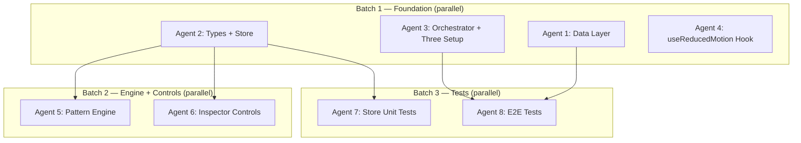

# CombatSystem — Agent Implementation Prompts

> **Usage:** Launch agents in batch order. All agents within a batch can run in parallel. Wait for a batch to complete before starting the next.



> [!IMPORTANT]
> **Batch 4 (Bullet Manager, Flex Scene, Canvas Wrapper + Bloom)** requires a senior-tier agent due to complex Three.js porting, imperative R3F patterns, and conditional post-processing architecture. Those tasks are NOT included here.

---

## Batch 1 — Foundation (all parallel, no dependencies)

---

### Agent 1: Data Layer

**Task:** Add CombatSystem entries to the file tree, resume data, and console logs.

**Files to modify:**
- `src/data/fileTree.ts`
- `src/data/resumeData.ts`
- `src/data/consoleLogs.ts`

**Instructions:**

**1. `src/data/fileTree.ts`**

Add `Gamepad2` to the named imports from `lucide-react` (line 2-16). Then add a CombatSystem entry as the 3rd child inside the `03_Projects` folder (the folder with `id: 'projects'`).

Current children array (lines 55-58):
```ts
children: [
  { id: 'hammerball', label: 'HammerBall_LiveOps.exe', icon: Hammer },
  { id: 'analytics-extension', label: 'Indeed_Analytics_Chrome_Extension.crx', icon: Puzzle },
],
```

Add after `analytics-extension`:
```ts
{ id: 'combat_system', label: 'Combat_System.three', icon: Gamepad2 },
```

**2. `src/data/resumeData.ts`**

Add a new entry to the `RESUME_DATA` record. Insert it after the `'hammerball'` entry (line 160). Follow the exact `ProjectEntry` interface shape:

```ts
'combat_system': {
  fileId: 'combat_system',
  title: 'CombatSystem Combat Engine',
  company: 'Personal Project',
  dates: '',
  type: 'project',
  bullets: [
    'Composable bullet-pattern system with 15 generators, 9 modifiers, and functional composition \u2014 each pattern is a pure function returning spawn data.',
    'GPU-instanced bullet renderer using InstancedMesh with a 5,000-bullet pool, zero-allocation physics loop, and per-instance color via setColorAt.',
    'Procedural IK spider/centipede enemies and multi-phase boss AI with state-machine-driven attack patterns.',
  ],
  controls: ['combatSystemPattern', 'combatSystemFireRate', 'combatSystemBloom'],
},
```

**3. `src/data/consoleLogs.ts`**

Add a new key to `FILE_LOG_MAP` (line 13, before the closing `}`):

```ts
'combat_system':            '> [GAME] CombatSystem combat engine initialized. Pattern pipeline active.',
```

**Verify:** Run `npm run build` from the project root. It must pass with zero errors.

---

### Agent 2: Types + Zustand Store

**Task:** Create the `CombatSystemPattern` union type file and add 3 new transient fields to the Zustand store.

**Files to create:**
- `src/components/3d/scenes/combat-system-types.ts`

**Files to modify:**
- `src/store/useEngineStore.ts`

**Instructions:**

**1. Create `src/components/3d/scenes/combat-system-types.ts`**

```ts
export type CombatSystemPattern = 'fibonacciSphere' | 'torusKnot' | 'galaxy' | 'helix' | 'rose3D' | 'ring';

export const COMBAT_SYSTEM_PATTERN_LABELS: Record<CombatSystemPattern, string> = {
  fibonacciSphere: 'Fibonacci Sphere',
  torusKnot: 'Torus Knot',
  galaxy: 'Galaxy',
  helix: 'Helix',
  rose3D: 'Rose 3D',
  ring: 'Ring',
} as const;
```

**2. Modify `src/store/useEngineStore.ts`**

Make these 4 changes:

**(a)** Add import at the top of the file (after line 2):
```ts
import type { CombatSystemPattern } from '@/components/3d/scenes/combat-system-types';
```

**(b)** Add 3 fields to the `TransientUpdates` interface (after line 20, before the closing `}`):
```ts
combatSystemPattern?: CombatSystemPattern;
combatSystemFireRate?: number;
combatSystemBloom?: number;
```

**(c)** Add 3 fields to the `EngineState` interface, in the transient section (after line 47, after `showNavMesh: boolean;`):
```ts
// Combat System Flex
combatSystemPattern: CombatSystemPattern;
combatSystemFireRate: number;
combatSystemBloom: number;
```

**(d)** Add defaults to the store initializer (after line 105, after `showNavMesh: false,`):
```ts
combatSystemPattern: 'fibonacciSphere' as CombatSystemPattern,
combatSystemFireRate: 1.5,
combatSystemBloom: 1.2,
```

**Verify:** Run `npm run build`. It must pass with zero TypeScript errors.

---

### Agent 3: Scene Orchestrator + Three.js Setup

**Task:** Register `'combat_system'` as a flex scene key and extend `Fog` for tree-shaking.

**Files to modify:**
- `src/components/3d/scene-orchestrator.tsx`
- `src/components/3d/three-setup.ts`

**Instructions:**

**1. `src/components/3d/scene-orchestrator.tsx`**

**(a)** Add `'combat_system'` to the `FLEX_SCENE_IDS` set (line 11):

Change:
```ts
const FLEX_SCENE_IDS = new Set(['ibm-staff-swe', 'indeed-sr-swe', 'hammerball']);
```
To:
```ts
const FLEX_SCENE_IDS = new Set(['ibm-staff-swe', 'indeed-sr-swe', 'hammerball', 'combat_system']);
```

**(b)** Add `'combat_system'` to the `SceneKey` union type (line 13):

Change:
```ts
export type SceneKey = 'ibm-staff-swe' | 'indeed-sr-swe' | 'hammerball' | 'default';
```
To:
```ts
export type SceneKey = 'ibm-staff-swe' | 'indeed-sr-swe' | 'hammerball' | 'combat_system' | 'default';
```

**2. `src/components/3d/three-setup.ts`**

**(a)** Add `Fog` to the import from `three` (line 11-27). Add it after `Color`:
```ts
Fog,
```

**(b)** Add `Fog` to the `extend()` call (line 29-45). Add it after `Color`:
```ts
Fog,
```

**Verify:** Run `npm run build`. It must pass with zero errors.

---

### Agent 4: useReducedMotion Hook

**Task:** Create a shared `useReducedMotion` hook using `useSyncExternalStore` that reacts to live OS preference changes.

**Files to create:**
- `src/hooks/useReducedMotion.ts`

**Instructions:**

Create the file with this exact content:

```ts
import { useSyncExternalStore } from 'react';

const QUERY = '(prefers-reduced-motion: reduce)';

function subscribe(callback: () => void): () => void {
  const mql = window.matchMedia(QUERY);
  mql.addEventListener('change', callback);
  return () => mql.removeEventListener('change', callback);
}

function getSnapshot(): boolean {
  return window.matchMedia(QUERY).matches;
}

function getServerSnapshot(): boolean {
  return false;
}

/**
 * Reactive hook for prefers-reduced-motion.
 * Uses useSyncExternalStore to react to live OS setting changes.
 *
 * Use this in WebGL/R3F components where Motion for React's
 * useReducedMotion() is not available or appropriate.
 */
export function useReducedMotion(): boolean {
  return useSyncExternalStore(subscribe, getSnapshot, getServerSnapshot);
}
```

**Verify:** Run `npm run build`. It must pass with zero errors. The file should have no imports other than `react`.

---

## Batch 2 — Engine + Controls (depends on Batch 1)

> [!IMPORTANT]
> Wait for **Agent 2** (Types + Store) to complete before starting Batch 2.

---

### Agent 5: Pattern Engine

**Task:** Port 6 pattern generators and 4 modifiers from the original CombatSystem `Patterns.js` into a typed TypeScript module.

**Files to create:**
- `src/components/3d/scenes/combat-system-patterns.ts`

**Source reference:** Read the original file at `meatSaber/src/Patterns.js` in the project root. Port the following functions, converting them to TypeScript with proper types.

**Instructions:**

1. Import `Vector3`, `Quaternion` from `three` (direct import, NOT through R3F).
2. Import `CombatSystemPattern` from `./combat-system-types`.
3. Define module-scope scratch vectors — these are reused across all function calls to avoid garbage collection:
   ```ts
   const _v1 = new Vector3();
   const _v2 = new Vector3();
   const _q1 = new Quaternion();
   ```
4. Define the `BulletSpawnData` interface:
   ```ts
   export interface BulletSpawnData {
     offset: Vector3;
     velocity: Vector3;
     acceleration: Vector3;
     delay: number;
     color: number | null;
     life: number;
   }
   ```
5. Port the object pool (`acquire`/`release`) from the original. The pool should return `BulletSpawnData` objects and reset their fields on acquire.
6. Port these 6 generators from the original `Patterns.js`:
   - `fibonacciSphere(count, radius)` — golden angle distribution
   - `torusKnot(count)` — parametric torus knot curve
   - `galaxy(count)` — logarithmic spiral arms
   - `helix(count)` — DNA-style double helix
   - `rose3D(count)` — 3D rose curve
   - `ring(count)` — classic ring burst
7. Port these 4 modifiers:
   - `color(hex)` — sets `data.color` to the given hex
   - `accelerate(forward, lateral)` — **IMPORTANT: Replace `s.velocity.clone().normalize()` with `_v1.copy(s.velocity).normalize()` to avoid per-bullet allocation**
   - `sequence(delayPerBullet)` — staggers bullet delays
   - `rotate(axis, angle)` — rotates all offsets/velocities
8. Port the `compose(generator, ...modifiers)` function.
9. Export `PATTERN_REGISTRY` with exhaustive type checking:
   ```ts
   export const PATTERN_REGISTRY = {
     fibonacciSphere: () => compose(gen.fibonacciSphere(200, 2), mod.color(0x39FF14)),
     torusKnot: () => compose(gen.torusKnot(300), mod.color(0xFF3333)),
     galaxy: () => compose(gen.galaxy(250), mod.color(0x6666FF)),
     helix: () => compose(gen.helix(200), mod.color(0xFF66FF)),
     rose3D: () => compose(gen.rose3D(200), mod.color(0xFFFF33)),
     ring: () => compose(gen.ring(100), mod.color(0x33FFFF)),
   } as const satisfies Record<CombatSystemPattern, () => BulletSpawnData[]>;
   ```
10. Export a `releaseSpawnData(data: BulletSpawnData[])` function that returns objects to the pool.

**Critical rules:**
- NEVER use `new Vector3()`, `new Quaternion()`, or `.clone()` inside any generator or modifier function body. Use the module-scope scratch vectors `_v1`, `_v2`, `_q1` instead.
- The pool's `acquire()` should reset all fields on the returned object.
- All generators should return `BulletSpawnData[]`.

**Verify:** Run `npm run build`. It must pass with zero TypeScript errors.

---

### Agent 6: Inspector Controls

**Task:** Add CombatSystem's 3 interactive controls to the inspector panel's `CONTROL_SPECS`.

**Files to modify:**
- `src/components/inspector-panel.tsx`

**Dependencies:** Requires `combat-system-types.ts` from Agent 2.

**Instructions:**

1. Add import at the top of the file:
   ```ts
   import { COMBAT_SYSTEM_PATTERN_LABELS, type CombatSystemPattern } from '@/components/3d/scenes/combat-system-types';
   ```

2. Find the `CONTROL_SPECS` object in the file. Add these 3 entries after the last existing entry:
   ```ts
   combatSystemPattern: {
     type: 'radio',
     label: 'Bullet Pattern',
     field: 'combatSystemPattern',
     options: Object.keys(COMBAT_SYSTEM_PATTERN_LABELS),
     formatLabel: (key: string) => COMBAT_SYSTEM_PATTERN_LABELS[key as CombatSystemPattern] ?? key,
   },
   combatSystemFireRate: {
     type: 'slider',
     label: 'Auto-fire Rate',
     field: 'combatSystemFireRate',
     min: 0.3,
     max: 3.0,
     step: 0.1,
     formatValue: (v: number) => `${v.toFixed(1)}/s`,
   },
   combatSystemBloom: {
     type: 'slider',
     label: 'Bloom Intensity',
     field: 'combatSystemBloom',
     min: 0.0,
     max: 3.0,
     step: 0.1,
     formatValue: (v: number) => v.toFixed(1),
   },
   ```

3. **If `RadioGroupControl` does NOT already support a `formatLabel` prop:** Add one. Find the radio button rendering code and use `formatLabel` to transform the option key into a display label. If no `formatLabel` is provided, fall back to displaying the raw option string.

4. **If `CONTROL_SPECS` has a TypeScript type** that constrains the `field` property to `keyof TransientUpdates`, verify the new fields are accepted. They should be, since Agent 2 added them to `TransientUpdates`.

**Verify:** Run `npm run build`. It must pass with zero errors.

---

## Batch 3 — Tests (depends on Batch 1 + 2)

> [!IMPORTANT]
> Wait for **Agent 2** (store changes) and **Agent 1** (data layer) to complete before starting Batch 3.

---

### Agent 7: Store Unit Tests

**Task:** Add CombatSystem-specific unit tests to the existing Zustand store test file.

**Files to modify:**
- `__tests__/useEngineStore.test.ts`

**Instructions:**

Add these 3 tests inside the existing `describe('useEngineStore', ...)` block (after the last test, before the closing `})`):

```ts
test('combat_system transient state defaults', () => {
  const state = useEngineStore.getState();
  expect(state.combatSystemPattern).toBe('fibonacciSphere');
  expect(state.combatSystemFireRate).toBe(1.5);
  expect(state.combatSystemBloom).toBe(1.2);
});

test('setTransientState updates combat_system fields', () => {
  useEngineStore.getState().setTransientState({
    combatSystemPattern: 'galaxy',
    combatSystemFireRate: 2.5,
    combatSystemBloom: 0.5,
  });
  const state = useEngineStore.getState();
  expect(state.combatSystemPattern).toBe('galaxy');
  expect(state.combatSystemFireRate).toBe(2.5);
  expect(state.combatSystemBloom).toBe(0.5);
});

test('resetStore restores combat_system defaults', () => {
  useEngineStore.getState().setTransientState({
    combatSystemPattern: 'galaxy',
    combatSystemFireRate: 0.5,
    combatSystemBloom: 3.0,
  });
  useEngineStore.getState().resetStore();
  const state = useEngineStore.getState();
  expect(state.combatSystemPattern).toBe('fibonacciSphere');
  expect(state.combatSystemFireRate).toBe(1.5);
  expect(state.combatSystemBloom).toBe(1.2);
});
```

Also update the existing `'resetStore restores initial state'` test (around line 143) to include CombatSystem field assertions. Add these lines after the existing `expect(state.showNavMesh).toBe(false);` line:

```ts
expect(state.combatSystemPattern).toBe('fibonacciSphere');
expect(state.combatSystemFireRate).toBe(1.5);
expect(state.combatSystemBloom).toBe(1.2);
```

And add a CombatSystem mutation before the reset call in that same test:
```ts
useEngineStore.getState().setTransientState({ combatSystemPattern: 'galaxy' });
```

**Verify:** Run `npm test`. All tests must pass, including the 3 new ones.

---

### Agent 8: E2E Tests

**Task:** Add Playwright E2E tests for CombatSystem file tree, inspector, and console integration.

**Files to modify:**
- `e2e/portfolio.spec.ts`

**Instructions:**

Add these tests inside the appropriate `describe` block or at the end of the file:

```ts
test('combat_system file → inspector shows controls', async ({ page }) => {
  // Expand 03_Projects folder
  await page.getByText('03_Projects').click();
  await page.getByText('Combat_System.three').click();

  // Inspector shows project entry
  await expect(page.getByText('CombatSystem Combat Engine')).toBeVisible();
  await expect(page.getByText('Personal Project')).toBeVisible();

  // Controls render with human-readable labels
  await expect(page.getByText('Bullet Pattern')).toBeVisible();
  await expect(page.getByText('Auto-fire Rate')).toBeVisible();
  await expect(page.getByText('Bloom Intensity')).toBeVisible();

  // 6 radio options
  await expect(page.getByRole('radio')).toHaveCount(6);
  await expect(page.getByLabel('Fibonacci Sphere')).toBeVisible();
});

test('combat_system file → console log', async ({ page }) => {
  await page.getByText('03_Projects').click();
  await page.getByText('Combat_System.three').click();
  await expect(
    page.getByText('> [GAME] CombatSystem combat engine initialized')
  ).toBeVisible();
});

test('combat_system respects reduced motion', async ({ page }) => {
  await page.emulateMedia({ reducedMotion: 'reduce' });
  await page.getByText('03_Projects').click();
  await page.getByText('Combat_System.three').click();
  // Canvas still mounts (graceful degradation, not removal)
  await expect(page.locator('canvas')).toBeVisible();
  // Controls still function
  await expect(page.getByText('Bullet Pattern')).toBeVisible();
});
```

**Important:** Read the existing `e2e/portfolio.spec.ts` first to understand the test structure, imports, and any `beforeEach` setup. Match the existing patterns (e.g., `test.describe` blocks, page navigation setup).

**Verify:** Do NOT run Playwright tests yet (the 3D scene isn't built). Just verify `npm run build` passes and the test file has no syntax errors. The tests will pass once the full implementation is complete.

---

## Not Included — Senior Agent Tasks

The following tasks require a senior-tier agent and are NOT covered by these prompts:

| Task | Why Senior |
|---|---|
| **Bullet Manager** (`combat-system-bullets.tsx`) | Complex Three.js InstancedMesh porting, zero-alloc physics, DynamicDrawUsage, frustumCulled, pool init, reduced-motion static snapshot |
| **Flex Scene** (`combat-system-flex.tsx`) | R3F scene composition, useSceneGroup hook, matrixAutoUpdate optimization, fog interaction |
| **Canvas Wrapper + Bloom** (`canvas-wrapper.tsx`) | Conditional EffectComposer mount/unmount, imperative Bloom ref, PerformanceMonitor integration, useState exception in Canvas |
| **aria-live region** (`inspector-panel.tsx`) | Requires understanding of the full inspector rendering pipeline |
