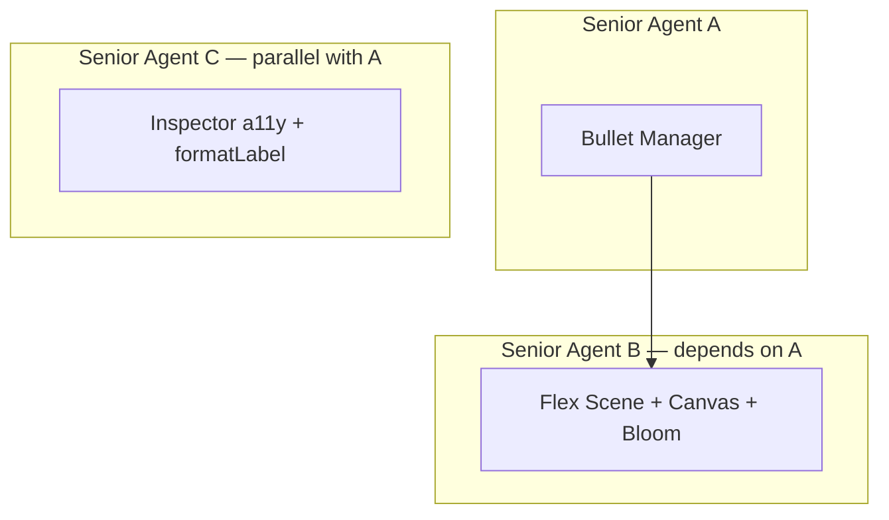

# CombatSystem — Senior Agent Prompts

> **Prerequisites:** All Batch 1-2 agents from `combat_system_agent_prompts.md` must have completed before launching these. Specifically:
> - `src/components/3d/scenes/combat-system-types.ts` exists (Agent 2)
> - `src/store/useEngineStore.ts` has `combatSystemPattern`, `combatSystemFireRate`, `combatSystemBloom` fields (Agent 2)
> - `src/components/3d/scene-orchestrator.tsx` has `'combat_system'` registered (Agent 3)
> - `src/components/3d/three-setup.ts` has `Fog` extended (Agent 3)
> - `src/hooks/useReducedMotion.ts` exists (Agent 4)
> - `src/components/3d/scenes/combat-system-patterns.ts` exists with `PATTERN_REGISTRY` and `releaseSpawnData` (Agent 5)



---

## Senior Agent A: Bullet Manager (`combat-system-bullets.tsx`)

**Task:** Port the vanilla Three.js BulletManager class into a zero-allocation R3F InstancedMesh component with auto-fire, reduced-motion support, and GPU-optimized buffer management.

**File to create:** `src/components/3d/scenes/combat-system-bullets.tsx`

**Original source to port (DO NOT use this verbatim — adapt to R3F patterns):**

```js
// /Users/kalebmon/Documents/meatSaber/src/BulletManager.js (160 lines)
import * as THREE from 'three';

export class BulletManager {
    constructor(scene, maxBullets = 5000) {
        this.scene = scene;
        this.maxBullets = maxBullets;
        this.bullets = [];
        this.activeCount = 0;

        const geometry = new THREE.SphereGeometry(0.15, 6, 6);
        const material = new THREE.MeshBasicMaterial({ color: 0xffffff });
        this.mesh = new THREE.InstancedMesh(geometry, material, maxBullets);
        this.mesh.instanceMatrix.setUsage(THREE.DynamicDrawUsage);
        this.mesh.frustumCulled = false;
        this.scene.add(this.mesh);

        const dummy = new THREE.Object3D();
        for (let i = 0; i < maxBullets; i++) {
            this.bullets.push({
                active: false,
                position: new THREE.Vector3(),
                velocity: new THREE.Vector3(),
                acceleration: new THREE.Vector3(),
                delay: 0,
                life: 0,
                index: i
            });
            dummy.position.set(0, -999, 0);
            dummy.updateMatrix();
            this.mesh.setMatrixAt(i, dummy.matrix);
            this.mesh.setColorAt(i, new THREE.Color(0xff3333));
        }
        this.mesh.instanceMatrix.needsUpdate = true;
        if (this.mesh.instanceColor) this.mesh.instanceColor.needsUpdate = true;

        this.dummy = new THREE.Object3D();
        this._tempVec = new THREE.Vector3();
    }

    spawn(sourcePos, spawnDataArray) {
        let spawnIdx = 0;
        for (let i = 0; i < this.maxBullets; i++) {
            if (spawnIdx >= spawnDataArray.length) break;
            const b = this.bullets[i];
            if (!b.active) {
                const data = spawnDataArray[spawnIdx];
                b.active = true;
                b.position.copy(sourcePos).add(data.offset);
                b.velocity.copy(data.velocity);
                b.acceleration.copy(data.acceleration);
                b.delay = data.delay;
                b.life = data.life;

                const color = data.color ? new THREE.Color(data.color) : new THREE.Color(0xff3333);
                this.mesh.setColorAt(i, color);

                if (b.delay <= 0) {
                    this.dummy.position.copy(b.position);
                    this.dummy.scale.setScalar(1.0);
                    this.dummy.updateMatrix();
                    this.mesh.setMatrixAt(i, this.dummy.matrix);
                }
                spawnIdx++;
            }
        }
        this.mesh.instanceMatrix.needsUpdate = true;
        if (this.mesh.instanceColor) this.mesh.instanceColor.needsUpdate = true;
    }

    update(dt, player) {
        let activeCount = 0;
        let needsUpdate = false;
        for (let i = 0; i < this.maxBullets; i++) {
            const b = this.bullets[i];
            if (b.active) {
                if (b.delay > 0) {
                    b.delay -= dt;
                    if (b.delay <= 0) {
                        this.dummy.position.copy(b.position);
                        this.dummy.scale.setScalar(1.0);
                        this.dummy.updateMatrix();
                        this.mesh.setMatrixAt(i, this.dummy.matrix);
                        needsUpdate = true;
                    }
                    continue;
                }
                b.velocity.addScaledVector(b.acceleration, dt);
                b.position.addScaledVector(b.velocity, dt);
                b.life -= dt;

                if (b.life <= 0 || Math.abs(b.position.x) > 50 || Math.abs(b.position.y) > 50 || Math.abs(b.position.z) > 50) {
                    b.active = false;
                    this.dummy.position.set(0, -999, 0);
                    this.dummy.updateMatrix();
                    this.mesh.setMatrixAt(i, this.dummy.matrix);
                    needsUpdate = true;
                    continue;
                }
                this.dummy.position.copy(b.position);
                this.dummy.scale.setScalar(Math.min(b.life, 1.0));
                this.dummy.updateMatrix();
                this.mesh.setMatrixAt(i, this.dummy.matrix);
                needsUpdate = true;
                activeCount++;
            }
        }
        if (needsUpdate) this.mesh.instanceMatrix.needsUpdate = true;
        this.activeCount = activeCount;
    }
}
```

---

### Architecture rules you MUST follow

**1. Zero-allocation in `useFrame`:** The `useFrame` callback runs 60× per second. You must NEVER call `new Vector3()`, `new Color()`, `new Object3D()`, or `.clone()` inside it. Allocate all scratch objects via `useMemo` at the component top level:

```tsx
const _dummy = useMemo(() => new Object3D(), []);
const _tempColor = useMemo(() => new Color(), []);
```

**2. Imperative store reads only:** Inside `useFrame`, read state via `useEngineStore.getState()` — never via reactive hooks like `useEngineStore((s) => s.field)`. Reactive hooks cause React re-renders; `getState()` is a synchronous read with zero re-renders.

**3. No `useState` inside this component:** All state that changes per-frame (bullet positions, timers, counts) must live in refs or mutable arrays. `useState` triggers React re-renders.

**4. Frame-rate independence:** All physics and timers must multiply by `delta`:
```tsx
// ✅ Correct
sourceRotation += delta * ROTATION_SPEED;
// ❌ Wrong — frame-rate dependent
sourceRotation += 0.01;
```

---

### Implementation spec

```tsx
'use client';

import { useRef, useMemo, useEffect } from 'react';
import { useFrame } from '@react-three/fiber';
import { Object3D, Color, Vector3, DynamicDrawUsage, type InstancedMesh as InstancedMeshType } from 'three';
import { useEngineStore } from '@/store/useEngineStore';
import { useReducedMotion } from '@/hooks/useReducedMotion';
import { PATTERN_REGISTRY, releaseSpawnData } from './combat-system-patterns';
import type { CombatSystemPattern } from './combat-system-types';

// --- Constants ---
const ROTATION_SPEED = 0.3;          // radians/sec for source position orbit
const BOUNDS_LIMIT = 25;             // Must match fog far plane
const SPAWN_CENTER_Y = 3;            // Bullets spawn from center at this height
const REDUCED_MOTION_MAX = 200;      // Bullet cap under reduced motion

interface BulletState {
  active: boolean;
  position: Vector3;
  velocity: Vector3;
  acceleration: Vector3;
  delay: number;
  life: number;
}

interface BulletManagerProps {
  maxBullets?: number;
}
```

**Component body requirements:**

1. **Props:** Accept `maxBullets` (default `2000`).
2. **Refs:** `meshRef` for `<instancedMesh>`, `bulletsRef` for the CPU-side `BulletState[]` array, `timeAccum` ref for auto-fire timer, `sourceRotation` ref for Y-axis orbit.
3. **Scratch objects via `useMemo`:** `_dummy` (Object3D), `_tempColor` (Color), `_sourcePos` (Vector3).
4. **Pool initialization (`useEffect` on mount):**
   - Create `BulletState[]` array of size `maxBullets`, each with pre-allocated `Vector3` instances (allocated ONCE here, reused forever).
   - Set `meshRef.current.instanceMatrix.setUsage(DynamicDrawUsage)` — GPU buffer hint for 2000 instances updated per frame.
   - Loop through all instances: set `_dummy.position` to `(0, -999, 0)`, call `updateMatrix()`, `setMatrixAt()`, and `setColorAt()` with black. This prevents a first-frame flash of 2000 white spheres at origin.
   - Set both `instanceMatrix.needsUpdate` and `instanceColor!.needsUpdate` after the init loop.

5. **`useFrame` loop:**
   - Read `combatSystemPattern`, `combatSystemFireRate` from `useEngineStore.getState()`.
   - Read `prefersReduced` from the `useReducedMotion()` hook (called at component top level, not inside useFrame).
   - **Auto-fire timer:** Accumulate `delta`. When `timeAccum >= 1 / fireRate`:
     - Call `PATTERN_REGISTRY[currentPattern]()` to get spawn data array
     - Calculate source position: orbit around Y axis at `(cos(rotation) * 2, SPAWN_CENTER_Y, sin(rotation) * 2)`
     - Call internal `spawn(sourcePos, spawnData)` 
     - Call `releaseSpawnData(spawnData)` to return objects to the pattern pool
     - Reset timer
     - If `prefersReduced`: skip timer, spawn ONCE with velocity zeroed (static snapshot), never rotate
   - **Update loop:** For each bullet in the pool:
     - Skip inactive bullets
     - Handle delay countdown (hide until delay <= 0)
     - Apply physics: `velocity.addScaledVector(acceleration, dt)`, `position.addScaledVector(velocity, dt)`
     - Decrement `life` by `dt`
     - Deactivate if `life <= 0` or position exceeds `BOUNDS_LIMIT` on any axis
     - Scale by `Math.min(life, 1.0)` for fade effect
     - Call `_dummy.updateMatrix()` + `meshRef.setMatrixAt(i, _dummy.matrix)`
   - **Batch needsUpdate:** After the FULL loop completes, set `instanceMatrix.needsUpdate = true` and `instanceColor.needsUpdate = true` ONCE. Never per-bullet.

6. **Internal `spawn()` function:**
   - Find inactive bullets in the pool, copy data from spawn array
   - **BUG FIX from original:** Replace `new THREE.Color(data.color)` with `_tempColor.set(data.color ?? 0xff3333); meshRef.setColorAt(i, _tempColor);` — zero allocation.

7. **Reduced motion behavior:**
   - On first render when `prefersReduced` is true: spawn a single pattern with all velocities set to zero → static geometric snapshot
   - Skip auto-fire timer entirely (no continuous spawning)
   - Skip source rotation
   - Cap to `REDUCED_MOTION_MAX` bullets

8. **JSX return:**
```tsx
return (
  <instancedMesh
    ref={meshRef}
    args={[undefined, undefined, maxBullets]}
    frustumCulled={false}
  >
    <sphereGeometry args={[0.12, 6, 6]} />
    <meshBasicMaterial fog={false} />
  </instancedMesh>
);
```

**Critical details:**
- `frustumCulled={false}`: InstancedMesh bounding sphere is computed from the single geometry at origin, not from instance positions. Without this, the entire mesh culls when the camera looks away from origin.
- `fog={false}` on material: Bullets are neon particles with bloom. Scene fog would fight the bloom glow.
- `args={[undefined, undefined, maxBullets]}`: R3F pattern — geometry/material provided as children, only count from args.

**Verify:**
1. `npm run build` passes with zero errors
2. Component renders 2000 instances without TypeScript errors
3. Chrome DevTools Performance tab: zero `new Vector3`/`new Color` allocations inside the frame loop
4. No first-frame flash (all instances hidden at -999 on mount)
5. Bullets spawn, fly outward, fade, and deactivate correctly
6. `OS → Reduce motion` → static geometric snapshot, no continuous spawning

---

## Senior Agent B: Flex Scene + Canvas Wrapper + Bloom

**Task:** Create the CombatSystem flex scene, mount it in the canvas wrapper, add conditional bloom post-processing, and wire mobile/performance fallbacks.

**Depends on:** Senior Agent A (BulletManager component must exist).

**Files to create:**
- `src/components/3d/scenes/combat-system-flex.tsx`

**Files to modify:**
- `src/components/3d/canvas-wrapper.tsx`

**New dependencies to install:**
```bash
npm install @react-three/postprocessing postprocessing
```
After install, verify peer deps: `@react-three/postprocessing` must support `three@^0.174` and `@react-three/fiber@^9`.

---

### Part 1: `combat-system-flex.tsx`

Follow the exact pattern of the existing `hammerball-flex.tsx`. Here is its full source for reference:

```tsx
// src/components/3d/scenes/hammerball-flex.tsx (REFERENCE — do not modify)
'use client';

import { useRef, useMemo } from 'react';
import { useFrame } from '@react-three/fiber';
import { Color, type Mesh, type MeshStandardMaterial } from 'three';
import { useEngineStore } from '@/store/useEngineStore';
import { useSceneGroup } from '../scene-orchestrator';

const COLOR_PATROL = new Color('#a6e3a1');
// ... (see full file for pattern)

export function HammerBallFlex() {
  const groupRef = useSceneGroup('hammerball');   // <-- KEY: registers with orchestrator
  // ...
  return (
    <group ref={groupRef}>                         // <-- KEY: visibility toggled by orchestrator
      {/* scene contents */}
    </group>
  );
}
```

**Create `combat-system-flex.tsx` with:**

```tsx
'use client';

import { useSceneGroup } from '../scene-orchestrator';
import { BulletManager } from './combat-system-bullets';

export function CombatSystemFlex() {
  const groupRef = useSceneGroup('combat_system');

  return (
    <group ref={groupRef}>
      {/* Fog — requires Fog extended in three-setup.ts */}
      <fog attach="fog" args={['#050505', 5, 25]} />

      {/* Lighting */}
      <ambientLight args={[0x404040, 0.5]} />
      <pointLight position={[0, 5, 0]} args={[0x00cccc, 1, 20]} />

      {/* Floor plane — static, disable auto matrix updates */}
      <mesh
        rotation={[-Math.PI / 2, 0, 0]}
        ref={(m) => {
          if (m) {
            m.matrixAutoUpdate = false;
            m.updateMatrix();
          }
        }}
      >
        <planeGeometry args={[20, 20]} />
        <meshStandardMaterial color="#050505" />
      </mesh>

      {/* Grid overlay — static wireframe */}
      <mesh
        rotation={[-Math.PI / 2, 0, 0]}
        position={[0, 0.01, 0]}
        ref={(m) => {
          if (m) {
            m.matrixAutoUpdate = false;
            m.updateMatrix();
          }
        }}
      >
        <planeGeometry args={[20, 20, 20, 20]} />
        <meshBasicMaterial wireframe color="#39FF14" transparent opacity={0.15} />
      </mesh>

      {/* Bullet system */}
      <BulletManager />
    </group>
  );
}
```

**Critical constraints:**
- `matrixAutoUpdate={false}` on floor and grid: these meshes never move. Saves one `updateMatrix()` call per mesh per frame. Must call `updateMatrix()` once in the ref callback after setting position/rotation.
- `<fog>` requires `Fog` to be in the `extend()` call in `three-setup.ts` (done by Agent 3). Without it, the fog JSX element is unrecognized.
- **Bloom is NOT mounted here.** `<EffectComposer>` runs at the Canvas render-pass level — even with `visible={false}` on the group, the bloom pass would still execute. Bloom goes in the canvas wrapper.

---

### Part 2: Modify `canvas-wrapper.tsx`

Here is the current file (148 lines). You are making 3 changes:

```tsx
// CURRENT FILE: src/components/3d/canvas-wrapper.tsx
'use client';

import { memo, Suspense, useState, useCallback } from 'react';
import { Canvas, useThree } from '@react-three/fiber';
import { Stats, OrbitControls, PerformanceMonitor } from '@react-three/drei';
import { ACESFilmicToneMapping } from 'three';
import { useViewportRef } from '../viewport-ref-context';
import { WebGLErrorBoundary } from './error-boundary';
import { SceneOrchestrator } from './scene-orchestrator';
import { AdaptivePixelRatio } from './adaptive-pixel-ratio';
import IBMFlex from './scenes/ibm-flex';
import IndeedFlex from './scenes/indeed-flex';
import { HammerBallFlex } from './scenes/hammerball-flex';
import DefaultScene from './scenes/default-scene';
import { useEngineStore } from '@/store/useEngineStore';

import './three-setup';

// ... (WebGLFallback, OrbitControlsWithGestureGuard — DO NOT MODIFY)

function CanvasWrapperInner() {
  const viewportRef = useViewportRef();
  const [dpr, setDpr] = useState<number | [number, number]>([1, 1.5]);

  return (
    <WebGLErrorBoundary fallback={/* ... */}>
      <Canvas /* ... */>
        <PerformanceMonitor
          onIncline={() => setDpr(1.5)}
          onDecline={() => setDpr(1)}
          onChange={({ factor }) => setDpr(0.5 + 1.5 * factor)}
          flipflops={3}
          onFallback={() => setDpr(1)}
        >
          <SceneOrchestrator>
            <Suspense fallback={null}>
              <IBMFlex />
              <IndeedFlex />
              <HammerBallFlex />
              <DefaultScene />
            </Suspense>
          </SceneOrchestrator>
        </PerformanceMonitor>
        <OrbitControlsWithGestureGuard />
        <AdaptivePixelRatio />
        <Stats /* ... */ />
      </Canvas>
    </WebGLErrorBoundary>
  );
}

export const MemoizedCanvasWrapper = memo(CanvasWrapperInner);
```

---

**Change 1: Add imports** (at the top, after existing imports):

```tsx
import { useRef, useEffect } from 'react';               // Add useRef, useEffect to existing import
import { useFrame } from '@react-three/fiber';            // Add useFrame to existing import
import { EffectComposer, Bloom } from '@react-three/postprocessing';
import { CombatSystemFlex } from './scenes/combat-system-flex';
import { useReducedMotion } from '@/hooks/useReducedMotion';
```

Note: `useState`, `useCallback`, `memo`, `Suspense` are already imported. You need to ADD `useRef` and `useEffect` to the existing import from `react`, and ADD `useFrame` to the existing import from `@react-three/fiber`.

---

**Change 2: Add `<CombatSystemFlex />` inside the `<Suspense>` block:**

```tsx
<Suspense fallback={null}>
  <IBMFlex />
  <IndeedFlex />
  <HammerBallFlex />
  <CombatSystemFlex />        {/* ADD THIS LINE */}
  <DefaultScene />
</Suspense>
```

---

**Change 3: Create `ConditionalBloom` component and mount it in `<Canvas>`:**

Add this component ABOVE `CanvasWrapperInner`:

```tsx
/**
 * ConditionalBloom — mounts/unmounts EffectComposer based on active scene.
 *
 * ARCHITECTURE NOTES:
 * 1. useState is required here. Unlike scene groups (which toggle `visible`),
 *    EffectComposer must be fully React-unmounted to stop the GPU bloom pass.
 *    setState frequency = user file clicks (~0.5/sec max), not per-frame. Acceptable.
 *
 * 2. Bloom intensity is updated imperatively via ref in useFrame — NOT via React
 *    prop re-renders. The `intensity={1.2}` prop sets the initial value only.
 *
 * 3. Disabled on mobile (< 768px) and under prefers-reduced-motion.
 */
function ConditionalBloom() {
  const [active, setActive] = useState(false);
  const bloomRef = useRef<any>(null);
  const prefersReduced = useReducedMotion();

  useEffect(() => {
    const unsub = useEngineStore.subscribe(
      (s) => s.activeFileId,
      (id) => setActive(id === 'combat_system'),
      { fireImmediately: true }
    );
    return unsub;
  }, []);

  // Imperatively sync bloom intensity with slider — zero React re-renders
  useFrame(() => {
    if (bloomRef.current) {
      bloomRef.current.intensity = useEngineStore.getState().combatSystemBloom;
    }
  });

  const isMobile = typeof window !== 'undefined' && window.innerWidth < 768;
  if (!active || isMobile || prefersReduced) return null;

  return (
    <EffectComposer>
      <Bloom
        ref={bloomRef}
        luminanceThreshold={0}
        intensity={1.2}
        radius={0.5}
      />
    </EffectComposer>
  );
}
```

Mount `<ConditionalBloom />` inside `<Canvas>` but OUTSIDE `<SceneOrchestrator>` and OUTSIDE `<PerformanceMonitor>`. Place it after `<PerformanceMonitor>` and before `<OrbitControlsWithGestureGuard />`:

```tsx
<Canvas /* ... */>
  <PerformanceMonitor /* ... */>
    <SceneOrchestrator>
      <Suspense fallback={null}>
        {/* ... scenes ... */}
      </Suspense>
    </SceneOrchestrator>
  </PerformanceMonitor>
  <ConditionalBloom />                {/* ADD HERE */}
  <OrbitControlsWithGestureGuard />
  <AdaptivePixelRatio />
  <Stats /* ... */ />
</Canvas>
```

**Why outside SceneOrchestrator:** EffectComposer operates at the Canvas render-pass level. If nested inside SceneOrchestrator, it would be affected by scene group visibility toggling logic.

**Why outside PerformanceMonitor:** PerformanceMonitor measures frame performance. Bloom is a full-screen post-processing pass that should NOT be counted as part of scene rendering performance — it should be disabled separately.

---

**Verify (full integration checklist):**
1. `npm run build` passes with zero errors
2. `npm run dev` → open browser → click "Combat_System.three" in the file hierarchy:
   - Viewport: dark arena with neon green grid, bullets auto-firing in fibonacci sphere pattern with bloom glow
   - Inspector: shows project description + 3 interactive controls
3. Switch bullet pattern via radio → bullets change to new geometric shape
4. Adjust fire rate slider → spawn interval changes
5. Adjust bloom intensity slider → glow intensity changes in real-time
6. Click "Level_3_IBM_Staff_SWE.tsx" → scene switches cleanly, bloom stops (verify: Chrome DevTools → Performance tab → no `EffectComposer` in flamechart)
7. Click back to CombatSystem → scene + bloom restores
8. Resize browser to mobile width (375px) → bloom disabled, bullets still render
9. No WebGL errors in console during any transition

---

## Senior Agent C: Inspector Accessibility (`formatLabel` + `aria-live`)

**Task:** Extend `RadioGroupControl` to support human-readable labels via `formatLabel`, and add an `aria-live` region for WebGL pattern change announcements.

**File to modify:** `src/components/inspector-panel.tsx`

**This agent can run in parallel with Senior Agent A.**

---

### Existing code context

The `RadioControl` interface (line 60-65) currently looks like:

```tsx
interface RadioControl {
  type: 'radio';
  label: string;
  field: keyof TransientUpdates;
  options: string[];
}
```

The `RadioGroupControl` component (line 419-467) renders options directly:

```tsx
function RadioGroupControl({ spec, setTransientState }: { spec: RadioControl; /* ... */ }) {
  const value = useEngineStore((s) => s[spec.field as keyof typeof s]) as string;
  const groupId = useId();

  return (
    <fieldset className="space-y-2">
      <legend className="font-mono text-xs text-text-muted">{spec.label}</legend>
      <div className="flex flex-wrap gap-3" role="radiogroup" aria-label={spec.label}>
        {spec.options.map((option) => {
          const radioId = `${groupId}-${option}`;
          return (
            <div key={option} className="flex items-center gap-2 min-h-[44px]">
              <input
                id={radioId}
                type="radio"
                name={`${groupId}-${spec.field}`}
                value={option}
                checked={value === option}
                onChange={() => setTransientState({ [spec.field]: option } as TransientUpdates)}
                className="h-4 w-4 border-border bg-bg-panel text-text-accent accent-text-accent cursor-pointer"
              />
              <label
                htmlFor={radioId}
                className={`font-mono text-xs cursor-pointer select-none ${
                  value === option ? 'text-text-accent' : 'text-text-muted'
                }`}
              >
                {option}                    {/* <-- Currently shows raw option key */}
              </label>
            </div>
          );
        })}
      </div>
    </fieldset>
  );
}
```

**Problem:** The CombatSystem pattern radio options are internal camelCase keys like `'fibonacciSphere'`, `'torusKnot'`. These are meaningless to users. The existing HammerBall radio works fine because its options (`'Patrol'`, `'Aggro'`, `'Flee'`) are already human-readable.

---

### Change 1: Add `formatLabel` to `RadioControl` interface

```tsx
interface RadioControl {
  type: 'radio';
  label: string;
  field: keyof TransientUpdates;
  options: string[];
  formatLabel?: (option: string) => string;   // ADD THIS
}
```

### Change 2: Use `formatLabel` in `RadioGroupControl` rendering

In the label element inside `RadioGroupControl`, change:

```tsx
{option}
```

To:

```tsx
{spec.formatLabel ? spec.formatLabel(option) : option}
```

Also use it for the `aria-label` of each radio input. Add an `aria-label` to each `<input>`:

```tsx
<input
  id={radioId}
  type="radio"
  name={`${groupId}-${spec.field}`}
  value={option}
  checked={value === option}
  onChange={() => setTransientState({ [spec.field]: option } as TransientUpdates)}
  aria-label={spec.formatLabel ? spec.formatLabel(option) : option}
  className="h-4 w-4 border-border bg-bg-panel text-text-accent accent-text-accent cursor-pointer"
/>
```

### Change 3: Add `aria-live` region for pattern changes

The CombatSystem scene changes happen entirely in the WebGL canvas — screen reader users get no feedback when the pattern changes. Add a visually-hidden live region.

In the `FileEntryView` component, after the interactive controls `<div>` (after line 322), add:

```tsx
{/* aria-live region for WebGL scene changes */}
{entry.controls && entry.controls.includes('combatSystemPattern') && (
  <CombatSystemLiveRegion />
)}
```

Create the `CombatSystemLiveRegion` component (add it before `FileEntryView`):

```tsx
import { COMBAT_SYSTEM_PATTERN_LABELS, type CombatSystemPattern } from '@/components/3d/scenes/combat-system-types';

function CombatSystemLiveRegion() {
  const pattern = useEngineStore(
    (s) => s.combatSystemPattern
  ) as CombatSystemPattern;

  return (
    <div className="sr-only" role="status" aria-live="polite">
      {`Bullet pattern: ${COMBAT_SYSTEM_PATTERN_LABELS[pattern]}`}
    </div>
  );
}
```

**Important:** The `sr-only` CSS class must exist in your stylesheet. It should apply:
```css
.sr-only {
  position: absolute;
  width: 1px;
  height: 1px;
  padding: 0;
  margin: -1px;
  overflow: hidden;
  clip: rect(0, 0, 0, 0);
  white-space: nowrap;
  border-width: 0;
}
```

If `sr-only` is not already defined, add it to the global stylesheet. Check `src/app/globals.css` or equivalent.

---

### Change 4: Add the `COMBAT_SYSTEM_PATTERN_LABELS` import

At the top of the file, add:

```tsx
import { COMBAT_SYSTEM_PATTERN_LABELS, type CombatSystemPattern } from '@/components/3d/scenes/combat-system-types';
```

---

**Verify:**
1. `npm run build` passes with zero errors
2. Existing HammerBall radio still works exactly as before (no `formatLabel` → falls back to raw option text)
3. CombatSystem radio shows "Fibonacci Sphere", "Torus Knot", etc. (not "fibonacciSphere")
4. Screen reader (VoiceOver on Mac: `Cmd+F5`) → navigate to CombatSystem inspector → radio buttons announce human-readable labels
5. Switch pattern → `aria-live` region announces "Bullet pattern: Galaxy" (screen reader speaks this automatically without needing to navigate to it)

---

## Dependency Summary

```
Senior Agent A (Bullet Manager)  ──→  Senior Agent B (Flex + Canvas + Bloom)
Senior Agent C (Inspector a11y)  ──→  (independent, parallel with A)
```

Launch A and C in parallel (max 2). When A finishes, launch B.
